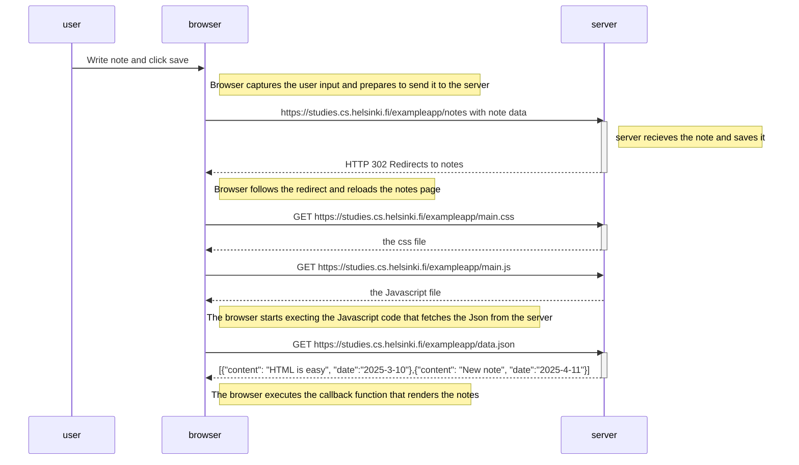

```mermaid

sequenceDiagram
    participant user
    participant browser
    participant server

    user->>browser: Write note and click save

    Note right of browser: Browser captures the user input and prepares to send it to the server

    browser->>server: https://studies.cs.helsinki.fi/exampleapp/notes with note data
    
    activate server
    
    Note right of server: server recieves the note and saves it
    
    server-->>browser: HTTP 302 Redirects to notes
    
    deactivate server

    Note right of browser: Browser follows the redirect and reloads the notes page

    browser->> server: GET https://studies.cs.helsinki.fi/exampleapp/main.css 

    activate server

    server-->>browser: the css file

    deactivate server

    browser->>server: GET https://studies.cs.helsinki.fi/exampleapp/main.js

    server-->> browser: the Javascript file 
    
  

    Note right of browser: The browser starts execting the Javascript code that fetches the Json from the server
    browser->>server:GET https://studies.cs.helsinki.fi/exampleapp/data.json 

   activate server

    server-->>browser: [{"content": "HTML is easy", "date":"2025-3-10"},{"content": "New note", "date":"2025-4-11"}]

    deactivate server

    Note right of browser: The browser executes the callback function that renders the notes

```