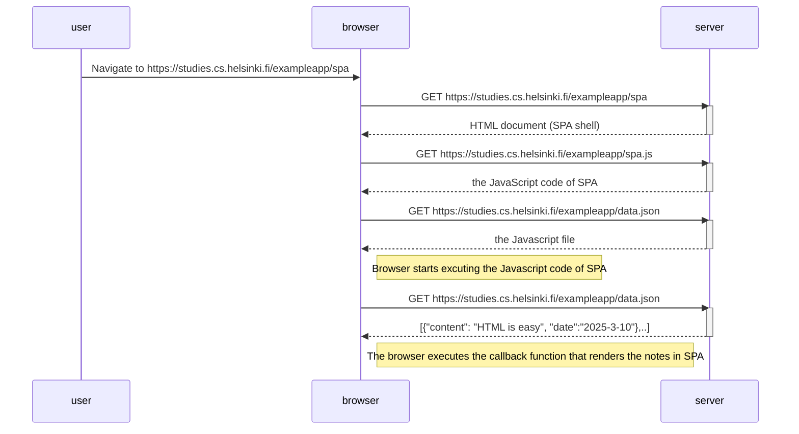

```mermaid

sequenceDiagram
    participant user
    participant browser
    participant server

    user->>browser: Navigate to https://studies.cs.helsinki.fi/exampleapp/spa

    browser ->> server: GET https://studies.cs.helsinki.fi/exampleapp/spa

    activate server

    server -->>browser : HTML document (SPA shell)

    deactivate server


    browser->>server: GET https://studies.cs.helsinki.fi/exampleapp/spa.js

    activate server
    
    server-->>browser: the JavaScript code of SPA
    deactivate server

   browser->> server: GET https://studies.cs.helsinki.fi/exampleapp/data.json
   
   activate server
    
    server-->>browser: the Javascript file
    
    deactivate server


   Note right of browser: Browser starts excuting the Javascript code of SPA

    browser->> server: GET https://studies.cs.helsinki.fi/exampleapp/data.json

    activate server

    server-->>browser: [{"content": "HTML is easy", "date":"2025-3-10"},..]

    deactivate server


   
    Note right of browser: The browser executes the callback function that renders the notes in SPA 

```