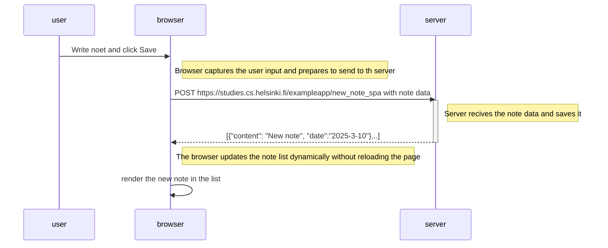

```mermaid

sequenceDiagram
    participant user
    participant browser
    participant server

    user->>browser: Write noet and click Save 

    Note right of browser: Browser captures the user input and prepares to send to th server
    browser ->> server: POST https://studies.cs.helsinki.fi/exampleapp/new_note_spa with note data

    activate server

    Note right of server: Server recives the note data and saves it

    server -->>browser : [{"content": "New note", "date":"2025-3-10"},..]

    deactivate server

    Note right of browser: The browser updates the note list dynamically without reloading the page

    browser->>browser: render the new note in the list
```